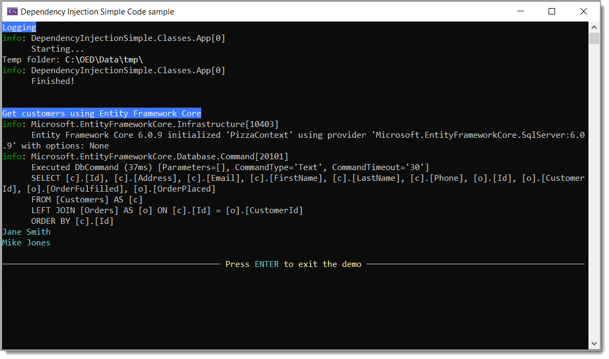

# About

Simple example for `dependency injection` for EF Core and simple logging. Nothing to do with ASP.NET Core environments.

# Requires

For the data access sample, run script.sql under the scripts folder first.



## appsettings.json

Stored information for both classes

```json
{
  "App": {
    "TempDirectory": "C:\\OED\\Data\\tmp\\"
  },
  "ConnectionsConfiguration": {
    "ActiveEnvironment": "Development",
    "Development": "Server=(localdb)\\MSSQLLocalDB;Database=OED.Pizza;Trusted_Connection=True",
    "Stage": "Stage connection string goes here",
    "Production": "Prod connection string goes here"
  }
}
```