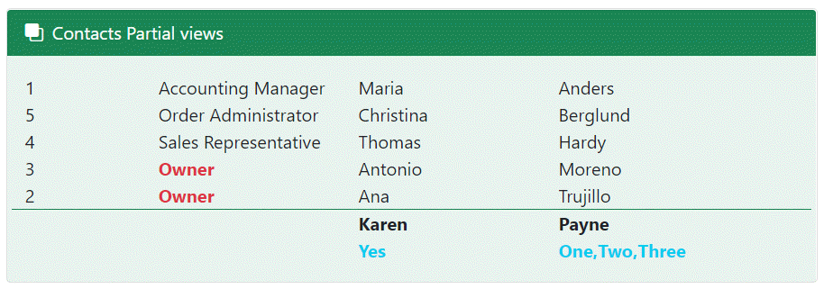

# Razor Partial Views

> **Note**
> From Microsoft: A partial view is a Razor markup file (.cshtml) without an @page directive that renders HTML output within another markup file's rendered output.

The term *partial view* is used when developing a Razor Pages app, where markup files are called pages. This topic generically refers to MVC views and Razor Pages pages as markup files.

Microsoft docs [](https://learn.microsoft.com/en-us/aspnet/core/mvc/views/partial?view=aspnetcore-6.0)

# Intent

The goal for this article/code sample is to provide and base for how to work with partial views and is not all encompassing so take time to read Microsoft documentation and then explore the code presented followed by experimenting on your own.

# Passing data to a partial view

In Index.cshtml the section on the right is populated using `Html.RenderPartialAsync` which streams the rendered output directly to the response. Because the method doesn't return a result, it must be called within a Razor code block as in the second image below.

The class `PageContainer` has several properties to show that any type of data can be passed to the partial view and in this case only the `Page` property is set to `CurrentPage.Index`, in `_IndexPartial.cshtml` there is a `switch` statement which decides which page to render mocked data from `MockedPageContents` which here is static data but can come from data in a database for instance.

For both `Index` and `About` pages mocked data is used to populate the right side container on the respective pages.


```csharp
public class PageContainer
{
    public string FirstName { get; set; }
    public string LastName { get; set; }
    public DateOnly DateOnly { get; set; }
    public CurrentPage Page { get; set; }
}
```

The `Contact` page passes an instance of `DataContainer`  with a key of DataContainer using `nameof(DataContainer)` rather than a string so that if the key changes so does `nameof(DataContainer)` the model, Contacts from EF Core.

> **Note**
> DataContainer is just one example of passing information between a page and a partial page. When passing data like this keep the data small in size for performance measures.

```csharp
@{

    /*
    * Here we are passing data that is not related to Contacts
    * to show it's possible to pass anything along in RenderPartialAsync
    */
    var data = new ViewDataDictionary(ViewData)
    {
        { nameof(DataContainer), new DataContainer()
            {
                FirstName = "Karen", 
                LastName = "Payne"
            }
        }
    };

    await Html.RenderPartialAsync("_ContactsPartial", Model.Contacts, data);
}
```

In `_ContactsPartial` page the key value is retrived using `ViewData`

```csharp
DataContainer container = (DataContainer)ViewData[nameof(DataContainer)];
```

From here, the first five contacts are presented using a foreach statement.

To present the key/value, `personName is {}` is the same as `personName is not null`

```csharp
if (container is {})
{
    <div class="row  border-success border-top">
        <div class="col-5"></div>
        <div class="col-3 text-dark fw-bold">@container.FirstName</div>
        <div class="col-3 text-dark fw-bold">@container.LastName</div>
    </div>   
    <div class="row">
        <div class="col-5"></div>
        <div class="col-3 text-info fw-bold">@container.SubContainer.Active.ToYesNo()</div>
        <div class="col-3 text-info fw-bold">@string.Join(",",@container.SubContainer.Items)</div>
    </div>   
}
```

The code above writes the last two rows. So this means if you want to pass other information, in this case or other cases besides the model this is one way to do so.




# Database

The `Contacts` Page requires a database. Before running this project, create the `NorthWind` database by running the script in the <kbd>Scripts</kbd> folder using Microsoft SQL-Server Management Studio (SSMS) or run the script and if so make sure to check the path in the script file first to ensure it matches the path where you databases are located.

## Database connections

The connection string resides in `appsettings.json` and is read using the following NuGet package [](https://www.nuget.org/packages/ConfigurationLibrary/)

# Bootstap

For those who have never explored possibilities with this library, take the time to learn from read their docs [](https://getbootstrap.com/docs/5.0/getting-started/introduction/) and what has been done in this project including inspecting break-points in `site.css`

Minimal use of [Bootstrap icons](https://icons.getbootstrap.com/) has been used and was added via libman [](https://learn.microsoft.com/en-us/aspnet/core/client-side/libman/libman-vs?view=aspnetcore-6.0).

# See also

- [Partial views in ASP.NET Core](https://learn.microsoft.com/en-us/aspnet/core/mvc/views/partial?view=aspnetcore-6.0) Microsoft
- [Partial Pages](https://www.learnrazorpages.com/razor-pages/partial-pages) Learn Razor Pages
- ASP.NET Core 6 [Razor Pages Fundamentals](https://app.pluralsight.com/library/courses/asp-dot-net-core-6-razor-pages-fundamentals/table-of-contents) Pluralsight


# Summary

Various methods have been presented for how to work with partial views, these sample are just a start, now go out and explore.
