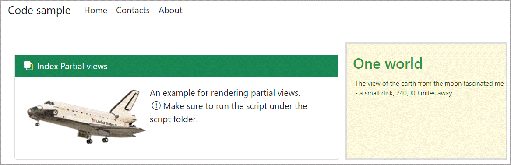
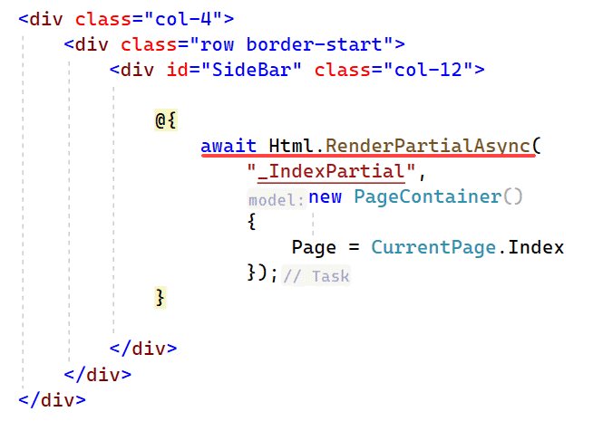
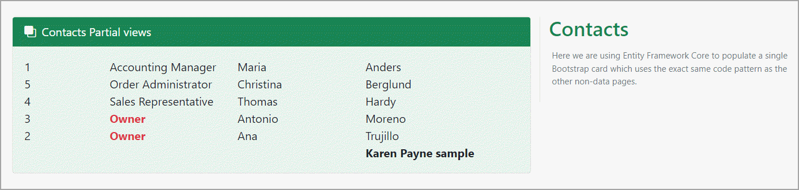

# Razor Partial Views

> **Note**
> From Microsoft: A partial view is a Razor markup file (.cshtml) without an @page directive that renders HTML output within another markup file's rendered output.

The term *partial view* is used when developing a Razor Pages app, where markup files are called pages. This topic generically refers to MVC views and Razor Pages pages as markup files.

Microsoft docs [](https://learn.microsoft.com/en-us/aspnet/core/mvc/views/partial?view=aspnetcore-6.0)

# Passing data to a partial view

In Index.cshtml the section on the right is populated using `Html.RenderPartialAsync` which streams the rendered output directly to the response. Because the method doesn't return a result, it must be called within a Razor code block as in the second image below.

The class `PageContainer` has several properties to show that any type of data can be passed to the partial view and in this case only the `Page` property is set to `CurrentPage.Index`, in `_IndexPartial.cshtml` there is a `switch` statement which decides which page to render mocked data from `MockedPageContents` which here is static data but can come from data in a database for instance.

For both `Index` and `About` pages mocked data is used to populate the right side container on the respective pages.





```csharp
public class PageContainer
{
    public string FirstName { get; set; }
    public string LastName { get; set; }
    public DateOnly DateOnly { get; set; }
    public CurrentPage Page { get; set; }
}
```

The `Contact` page passes a string as a key value pair and the model, Contacts from EF Core.

```csharp
@{
    var data = new ViewDataDictionary(ViewData) { { "Name", "Karen Payne sample" } };
    await Html.RenderPartialAsync("_ContactsPartial", Model.Contacts, data);
}
```

In `_ContactsPartial` page the key value is retrived using `ViewData`

```csharp
var personName = ViewData["Name"];
```

From here, the first five contacts are presented using a foreach statement.

To present the key/value, `personName is {}` is the same as `personName is not null`

```csharp
if (personName is {})
{
    <div class="row">
        <div class="col-8"></div><div class="col-3 text-dark fw-bold">@personName</div>
    </div>   
}
```




# Other options for partial views

TODO

# Bootstap


TODO

# Summary

TODO
